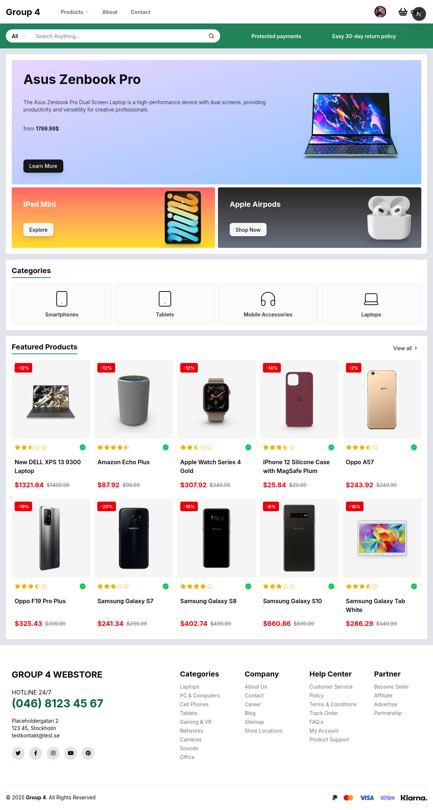
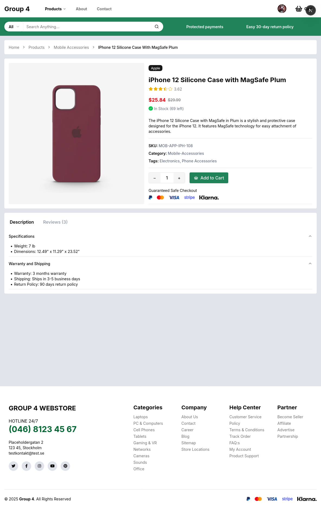
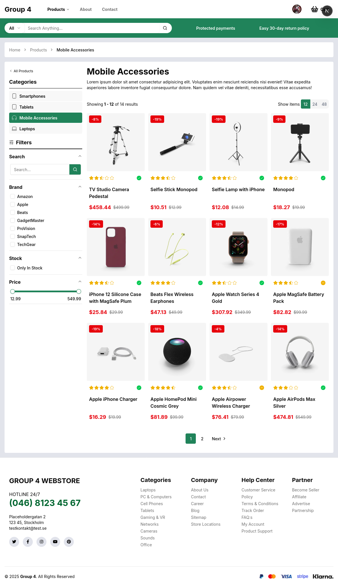
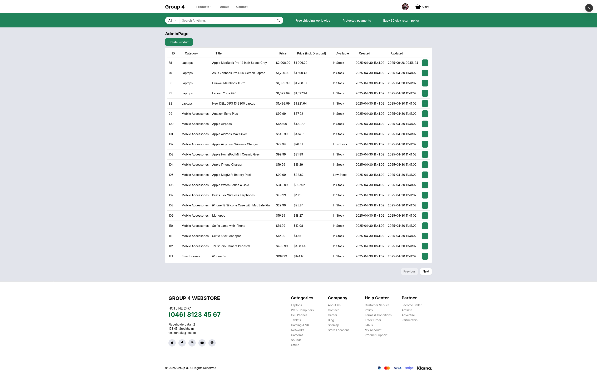

# E-commerce Storefront

## Beskrivning

Detta projekt är en e-handelsbutik byggd med Next.js, TypeScript och Tailwind CSS. Den innehåller ett användargränssnitt för att bläddra bland produkter, hantera en kundvagn och slutföra kassaprocessen. Applikationen innehåller också en adminpanel för att hantera produkter och andra butikskonfigurationer.

## Innehållsförteckning

- [Funktionalitet](#funktionalitet)
- [Teknologier](#teknologier)
- [Skärmdumpar](#skärmdumpar)
- [Installation](#installation)
- [Projektstruktur](#projektstruktur)
- [Arbetsflöde](#arbetsflöde)
- [Sprint Planning](#sprint-planning)
- [Användning](#användning)
- [Bidra](#bidra)
- [Lärdomar](#lärdomar)
- [Individuellt bidrag](#individuellt-bidrag)
- [Utvecklingsmöjligheter](#utvecklingsmöjligheter)
- [Licens](#licens)

## Funktionalitet

- **Produktkatalog:** Bläddra bland produkter efter kategori, filtrera efter varumärke, pris och lagerstatus.
- **Produktinformation:** Visa detaljerad information om enskilda produkter, inklusive recensioner och specifikationer.
- **Kundvagn:** Lägg till produkter i en kundvagn, uppdatera kvantiteter och fortsätt till kassan.
- **Kassa:** Slutför kassaprocessen säkert med Stripe-integration.
- **Användarautentisering:** Registrera dig, logga in och hantera användarkonton.
- **Adminpanel:** Hantera produkter, kategorier och andra butikskonfigurationer (åtkomlig för auktoriserade användare).
- **Kontaktformulär:** Skicka kontaktförfrågningar.

## Teknologier

- Next.js 15 (App Router)
- TypeScript
- Tailwind CSS 4
- Stripe
- Shadcn UI
- Zod (för form-validering)
- Clerk

- API: Tidigare versioner av projektet byggde på DummyJSON API:et. Senare versioner använder en klonad och reviderad version av API:et med anpassade endpoints som levererar en utökad datastruktur som originalversionen inte stödde.

## Skärmdumpar:

### Butik

|                Index                 |              Detaljsida                |                  Produktlista                 |
| :----------------------------------: | :------------------------------------: | :-------------------------------------------: |
|  |  |  |

### Admin

Produktlista
:-------------------------:
| 

## Installation

1.  **Klona repository:**

    ```bash
    git clone <repository_url>
    ```

2.  **Installera beroenden:**

    ```bash
    cd app
    npm install
    ```

3.  **Konfigurera miljö-variabler:**

    Create a `.env.local` file in the `app` directory and add the necessary environment variables (e.g., Stripe API keys, database connection string).

4.  **Kör utvecklingservern:**

    ```bash
    npm run dev
    ```

    Open [http://localhost:3000](http://localhost:3000) in your browser to view the application.

## Projektstruktur

```
app/
├── src/
│   ├── app/             # Next.js routes
│   ├── components/      # React components
│   ├── lib/             # Utility functions and data
│   ├── styles/          # Global styles
├── next.config.js   # Next.js configuration
├── package.json       # Project dependencies
```

## Arbetsflöde

Projektet har utformats genom ett grupparbete med fyra medlemmar.

Arbetet har utförts i form av ett agilt projekt med SCRUM-struktur, varpå en Kanban-bräda har används för att tilldela uppgifter mellan medlemmar. Projektet delades upp i veckolånga sprintar.

Projektet har utförts genom två branches: Dev och Main. Dev har fungerat som utvecklingsmiljö, och där har kod som fortfarande är under arbete landat. I slutet på varje sprint så skjuts det arbete som har genomförts under veckan mot Main-branchen för deployment.

### Dagsstruktur:

**Morgonmöte**

- Kort genomgång av vad som har genomförts och vad som ska genomföras av medlemmar.
- Se över aktuella issues, flytta från backlog till ready.
- Analys för nya idéer, skapa issues i backlog.
- Issues i behov av mer förfining/förarbete ligger kvar i backlog

Uppdelning av aktuella issues. Varje person tar de issues som de vill arbeta med.
När deltagare har blivit tilldelade ett issue så öppnar de en feature-branch där de arbetar isolerat på problemet.

**Eftermiddagsmöte**
Under dagen så har vi haft kontinuerlig kommunikation och bestämt en tid för ett eftermiddagsmöte.
Under det mötet så går vi igenom de pull requests som har samlats under dagen, och en person blir tilldelad rollen som Merge Master. 
För att en pull request ska kunna bli merge:ad till utvecklingsbranchen så krävs godkännanden av två övriga gruppmedlemmar, varpå Merge Master kan utföra det.

När alla PR har slutförts så sker samma process som under morgonmötet, alla deltagare går igenom de krav som finns på Kanban-brädan och nya krav analyseras.


## Sprint Planning

Projektet utfördes under tre veckolånga sprintar.

### Sprint 1

- Val av API och UX design
- Planering av sprint samt kort för sprinten (Kanban)
- Satte upp grundläggande NextJS projekt med statiska sidor
- Skapa upp grundläggande layout för startsida, kontaktsida och om oss sida
- Hämtning av data från API endpoint för att presentera det i en lista
- Skapa den dynamiska routen app/products/[id]/page.tsx för produktsidorna samt hämta data baserat på ID
- Breadcrumb för produktsidorna
- Första iteration av sökfunktion, paginering och lägg till i varukorg knapp

### Sprint 2

- Skapa den dynamiska routen app/category/[name]/page.tsx för att filtera produkter baserat på kategorinamn
- Filteringskolumn där man kan filtrera på namn, brand, in stock och pris
- Fork av DummyJSON med utökad funktionalitet
- Sökfunktion färdig och kopplad till produktsida
- Färdigställning av varukorg samt implementation av varukorg i header
- Navigering till kategorier från header
- Validering av fält i formulär på kontaktsida
- Implementering av inloggning Clerk
- Implementering av checkout med Stripe
  
### Sprint 3

- Skapa admingränssnitt med lista på produkter
- Implementation av MongoDB
- Validering av fält i formulär på adminsida
- CRUD funktionalitet på adminsida
- Authentication på adminsida via Clerk
- Bugfixar och förbättring av existerande kod
- Förbättrad responsivitet, tillgänglighet samt design

## Användning

- **Bläddra Bland Produkter:** Navigera till sidan `/products` för att visa produktkatalogen. Använd sidofältsfiltren för att förfina din sökning.
- **Visa Produktinformation:** Klicka på ett produktkort för att visa detaljerad information om produkten.
- **Lägga Till i Varukorgen:** Klicka på knappen "Lägg till i varukorgen" på produktdetaljsidan för att lägga till produkten i din varukorg.
- **Kassa:** Klicka på varukorgsikonen i sidhuvudet för att visa din varukorg. Fortsätt till kassan för att slutföra ditt köp.
- **Adminpanel:** Gå till adminpanelen på `/admin` (kräver autentisering).
 

## Bidra

Contributions are welcome! Please submit a pull request with your proposed changes.

## Lärdomar

- Arbeta i grupp, anpassa planering efter arbetstakt.
- Server vs Client komponenter
- Kontexter och providers
- Formulärvalidering med Zod, Use action state för felhantering
- Serverkommunikation med externa API
- Next.js server functions
- Externa ramverk som Clerk och Stripe
- Bestämma när ett projekt är klart/när man ska vara nöjd
- Mer utförligt användande av Github Projects, Issues, Pull Requests, kodgranskning

## Individuellt bidrag

Jag själv som gruppmedlem bidrog med att utveckla planerad funktionalitet, samt extrafunktioner.

Exempel på funktioner jag utvecklat är:
- Några statiska och dynamiska routes
- Komponenter baserade på Shadcn
- Hantering av searchParams för produktlistan
- Pagination för filtrering och paging
- Sortering och filtrering av viss produktdata mot API
- Slider och hantering för pris-filtrering
- Implementering av Clerk login

## Utvecklingsmöjligheter

Skulle jag själv fortsätta med detta projekt så skulle jag utöka API:t som det är beroende utav.
En del information som visas är hårdkodad, samt viss information simulerar bara att det sparas.
Presentativt ser det något färdigt ut, men mycket kan fortfarande styras från backend.
Sen om det faktiskt skulle användas så behövs någon form av orderhantering.

## Licens

[MIT](LICENSE)
